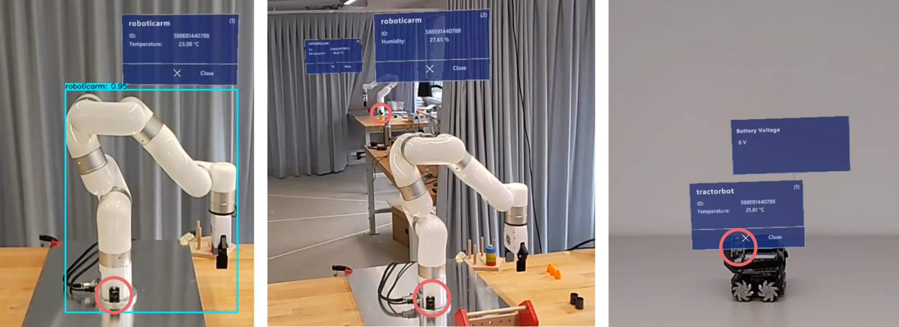

# BLEARVIS prototype

This repository contains the source code for the BLEARVIS prototype described in the publication (see the [PDF](https://github.com/Interactions-HSG/blearvis/blob/main/Strecker%20et%20al%20-%202023%20-%20MR%20Object%20Identification%20and%20Interaction.pdf) above):

Jannis Strecker, Khakim Akhunov, Federico Carbone, Kimberly García, Kenan Bektaş, Andres Gomez, Simon Mayer, and Kasim Sinan Yildirim. 2023. **MR Object Identification and Interaction: Fusing Object Situation Information from Heterogeneous Sources.** Proc. ACM Interact. Mob. Wearable Ubiquitous Technol. 7, 3, Article 124 (September 2023), 26 pages. https://doi.org/10.1145/3610879



_BLEARVIS can identify objects (left) while differentiating between visually identical devices (center), and create
interaction possibilities for users by accessing real-time data from these devices (right). The red circles indicate the positions
of the Bluetooth Low Energy (BLE) tags._

## 📄 Abstract

> The increasing number of objects in ubiquitous computing environments creates a need for effective object detection and identification mechanisms that permit users to intuitively initiate interactions with these objects. While multiple approaches to such object detection – including through visual object detection, fiducial markers, relative localization, or absolute spatial referencing – are available, each of these suffers from drawbacks that limit their applicability. In this paper, we propose ODIF, an architecture that permits the fusion of object situation information from such heterogeneous sources and that remains vertically and horizontally modular to allow extending and upgrading systems that are constructed accordingly. We furthermore present BLEARVIS, a prototype system that builds on the proposed architecture and integrates computer-vision (CV) based object detection with radio-frequency (RF) angle of arrival (AoA) estimation to identify BLE-tagged objects. In our system, the front camera of a Mixed Reality (MR) head-mounted display (HMD) provides a live image stream to a vision-based object detection module, while an antenna array that is mounted on the HMD collects AoA information from ambient devices. In this way, BLEARVIS is able to differentiate between visually identical objects in the same environment and can provide an MR overlay of information (data and controls) that relates to them. We include experimental evaluations of both, the CV-based object detection and the RF-based AoA estimation, and discuss the applicability of the combined RF and CV pipelines in different ubiquitous computing scenarios. BLEARVIS can form a starting point to spawn the integration of diverse object detection, identification, and interaction approaches that function across the electromagnetic spectrum, and beyond.

## 🚀 How to run the prototype

All source code used to run the BLEARVIS prototype is in the `code` folder. See the `README.md` files in each directory for a full description.
- [code/HoloLens/BLEARVIS-Desktop-ObjectDetection](https://github.com/Interactions-HSG/blearvis/tree/main/code/HoloLens/BLEARVIS-Desktop-ObjectDetection) contains the object detection based on YOLOv7 that uses the HL2's camera stream as an input.
- [code/HoloLens/BLEARVIS-HoloLens-Application](https://github.com/Interactions-HSG/blearvis/tree/main/code/HoloLens/BLEARVIS-HoloLens-Application) contains the app for the HL2 that is build with Unity.
- [code/SiLabs](https://github.com/Interactions-HSG/blearvis/tree/main/code/SiLabs) contains the code for the BLE sensor tag, the antenna array and the host device.

## 📹 Teaser Video
This video very briefly introduces the main contribution of BLEARVIS:

(also available on YouTube: https://youtu.be/pmwpOFGvSwc?si=P09sHjYhLqgmn-1O)

https://github.com/Interactions-HSG/blearvis/assets/11094168/78196c66-dc23-4ae6-a4a3-1848d5431f3b


## 📹 Demo Video
This demo video shows how objects can be detected, identified and situated by BLEARVIS with its different modules. Then the object information is shown in MR:

https://github.com/Interactions-HSG/blearvis/assets/11094168/81f15a94-6b31-4e6a-a91e-fa98a029dc64

## 📧 Contact

If you have questions about the prototype or the publication, feel free to contact Jannis Strecker ([jannisrene.strecker@unisg.ch](mailto:jannisrene.strecker@unisg.ch)).

This research was conducted in collaboration by the Interaction- and Communication-based Systems Group ([interactions.ics.unisg.ch](https://interactions.ics.unisg.ch)) at the University of St.Gallen ([ics.unisg.ch](https://ics.unisg.ch)), the Embedded and Networked Things Group ([tinysystems.github.io](https://tinysystems.github.io/)) at the University of Trento ([disi.unitn.it](https://www.disi.unitn.it/)), and the Institute of Computer and Network Engineering at TU Braunschweig ([ida.ing.tu-bs.de](https://www.ida.ing.tu-bs.de/)).


## 📚 Reference

If you use/modify this source code or refer to our paper, please add a reference to our publication:

> Jannis Strecker, Khakim Akhunov, Federico Carbone, Kimberly García, Kenan Bektaş, Andres Gomez, Simon Mayer, and Kasım Sinan Yıldırım. 2023. MR Object Identification and Interaction: Fusing Object Situation Information from Heterogeneous Sources. Proc. ACM Interact. Mob. Wearable Ubiquitous Technol. 7, 3 (September 2023), 26 pages. https://doi.org/10.1145/3610879

```bibtex
@article{strecker2023,
author = {Strecker, Jannis and Akhunov, Kahkim and Carbone, Federico and García, Kimberly and Bekta\c{s}, Kenan and Gomez, Andres and Mayer, Simon and Y\i{}ld\i{}r\i{}m, Kas\i{}m Sinan},
title = {MR Object Identification and Interaction: Fusing Object Situation Information from Heterogeneous Sources},
year = {2023},
issue_date = {September 2023},
publisher = {ACM},
address = {New York, NY, USA},
volume = {7},
number = {3},
url = {https://doi.org/10.1145/3610879},
doi = {10.1145/3610879},
abstract = {The increasing number of objects in ubiquitous computing environments creates a need for effective object detection and identification mechanisms that permit users to intuitively initiate interactions with these objects. While multiple approaches to such object detection – including through visual object detection, fiducial markers, relative localization, or absolute spatial referencing – are available, each of these suffers from drawbacks that limit their applicability. In this paper, we propose ODIF, an architecture that permits the fusion of object situation information from such heterogeneous sources and that remains vertically and horizontally modular to allow extending and upgrading systems that are constructed accordingly. We furthermore present BLEARVIS, a prototype system that builds on the proposed architecture and integrates computer-vision (CV) based object detection with radio-frequency (RF) angle of arrival (AoA) estimation to identify BLE-tagged objects. In our system, the front camera of a Mixed Reality (MR) head-mounted display (HMD) provides a live image stream to a vision-based object detection module, while an antenna array that is mounted on the HMD collects AoA information from ambient devices. In this way, BLEARVIS is able to differentiate between visually identical objects in the same environment and can provide an MR overlay of information (data and controls) that relates to them. We include experimental evaluations of both, the CV-based object detection and the RF-based AoA estimation, and discuss the applicability of the combined RF and CV pipelines in different ubiquitous computing scenarios. This research can form a starting point to spawn the integration of diverse object detection, identification, and interaction approaches that function across the electromagnetic spectrum, and beyond.},
journal = {Proc. ACM Interact. Mob. Wearable Ubiquitous Technol.},
month = {Sep},
articleno = {124},
numpages = {26},
keywords = {mixed reality, detection, identification, computer vision}
}
```

## 📑 License

All source code in this repository is licensed under the Apache License 2.0 (see [LICENSE](https://github.com/Interactions-HSG/blearvis/blob/main/LICENSE)) if not stated otherwise.
Included third-party code may be licensed differently (see the respective files and folders).
